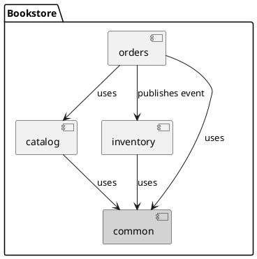
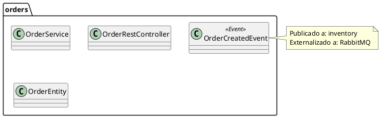

# Parte 6 — C4 Docs, Observabilidad y Docker

**Duración**: 15 minutos  
**Objetivo**: Generar documentación de arquitectura automáticamente, activar observabilidad y tener el entorno completo en Docker

---

## ¿Qué Haremos en Esta Parte?

El sistema funciona, los tests pasan y la arquitectura está verificada. Ahora lo terminamos de redondear para que sea un proyecto de producción real:

1. **Documentación C4 Model** generada directamente desde el código
2. **Observabilidad** con Actuator, Prometheus y Zipkin
3. **Docker Compose** para el entorno completo

---

## Documentación C4 Model con Spring Modulith

### El Problema de la Documentación Manual

La documentación de arquitectura tiene un ciclo de vida muy conocido:

```
Semana 1: Alguien dibuja un diagrama bonito en Confluence
Semana 4: El código evoluciona, el diagrama no
Semana 8: El diagrama muestra una arquitectura que ya no existe
Semana 12: Nadie mira el diagrama porque todos saben que está desactualizado
```

Spring Modulith resuelve esto: los diagramas se **generan desde el código**, en cada build. No pueden estar desactualizados porque son el código.

### Generar la Documentación

Agrega este método a `ModularityTest`:

```java
// src/test/java/com/geovannycode/bookstore/ModularityTest.java
package com.geovannycode.bookstore;

import org.junit.jupiter.api.Test;
import org.springframework.modulith.core.ApplicationModules;
import org.springframework.modulith.docs.Documenter;

class ModularityTest {

    static final ApplicationModules modules =
            ApplicationModules.of(BookstoreApplication.class);

    @Test
    void verifiesModularStructure() {
        modules.verify();
    }

    /**
     * Genera documentación C4 Model en target/spring-modulith-docs/
     *
     * Incluye:
     *   - components.puml: diagrama de componentes global
     *   - catalog.puml, orders.puml, inventory.puml: diagramas por módulo
     *   - aggregating-document.adoc: documento AsciiDoc completo
     *
     * Los .puml se pueden renderizar con PlantUML (plugin para IntelliJ,
     * VS Code, o el servidor online en plantuml.com).
     */
    @Test
    void writesDocumentationSnippets() {
        new Documenter(modules)
                .writeModulesAsPlantUml()
                .writeIndividualModulesAsPlantUml()
                .writeAggregatingDocument();
    }

    @Test
    void printsModuleStructure() {
        modules.forEach(System.out::println);
    }
}
```

### Ejecutar la Generación

```bash
./mvnw test -Dtest=ModularityTest
# o:
task docs
```

### Explorar los Archivos Generados

```bash
ls target/spring-modulith-docs/
# components.puml          ← diagrama global de módulos
# catalog.puml             ← canvas del módulo catalog
# orders.puml              ← canvas del módulo orders
# inventory.puml           ← canvas del módulo inventory
# common.puml
# aggregating-document.adoc ← documento completo en AsciiDoc
```

### El Diagrama de Componentes

`components.puml` muestra la vista de alto nivel del sistema — cómo se relacionan los módulos:



### El Canvas de un Módulo

`orders.puml` muestra el detalle interno del módulo `orders`:



### Renderizar en IntelliJ IDEA

Si usas IntelliJ:
1. Instala el plugin **PlantUML Integration** (disponible en el marketplace)
2. Abre cualquier `.puml` en `target/spring-modulith-docs/`
3. IntelliJ renderiza el diagrama en el panel de preview

Alternativamente, pega el contenido en [plantuml.com/plantuml/uml](https://plantuml.com).

---

## Observabilidad con Actuator

Spring Boot Actuator expone endpoints de management que Spring Modulith enriquece con información de módulos.

### Configuración en `application.properties`

```properties
# Expone todos los endpoints relevantes
management.endpoints.web.exposure.include=health,info,metrics,prometheus,modulith
management.endpoint.health.show-details=always
management.info.env.enabled=true

# Información de la aplicación
info.app.name=Bookstore Modulith
info.app.version=1.0.0
info.app.description=Workshop BAQJUG — Spring Modulith
```

### El Endpoint `/actuator/modulith`

Spring Modulith agrega este endpoint que muestra la estructura de módulos en tiempo de ejecución:

```bash
curl http://localhost:8080/actuator/modulith | python3 -m json.tool
```

Respuesta:
```json
{
  "modules": [
    {
      "name": "catalog",
      "basePackage": "com.geovannycode.bookstore.catalog",
      "type": "CLOSED",
      "dependencies": []
    },
    {
      "name": "orders",
      "basePackage": "com.geovannycode.bookstore.orders",
      "type": "CLOSED",
      "allowedDependencies": ["catalog"],
      "dependencies": ["catalog"]
    },
    {
      "name": "inventory",
      "basePackage": "com.geovannycode.bookstore.inventory",
      "type": "CLOSED",
      "dependencies": []
    },
    {
      "name": "common",
      "basePackage": "com.geovannycode.bookstore.common",
      "type": "OPEN",
      "dependencies": []
    }
  ]
}
```

Esto es la arquitectura del sistema como dato — puede ser consumido por dashboards, herramientas de análisis, o sistemas de monitoreo.

### Health Check

```bash
curl http://localhost:8080/actuator/health
```

```json
{
  "status": "UP",
  "components": {
    "db": {
      "status": "UP",
      "details": { "database": "PostgreSQL", "validationQuery": "isValid()" }
    },
    "rabbit": {
      "status": "UP",
      "details": { "version": "3.13.x" }
    },
    "diskSpace": { "status": "UP" }
  }
}
```

---

## Trazabilidad con Zipkin

Zipkin es una herramienta de distributed tracing. En un monolito modular, te permite ver el flujo completo de una petición a través de los módulos.

### Dependencias

```xml
<!-- pom.xml — ya incluido en el proyecto -->
<dependency>
    <groupId>io.micrometer</groupId>
    <artifactId>micrometer-tracing-bridge-brave</artifactId>
</dependency>
<dependency>
    <groupId>io.zipkin.reporter2</groupId>
    <artifactId>zipkin-reporter-brave</artifactId>
</dependency>
```

### Configuración

```properties
# application.properties
# 1.0 = samplea el 100% de las peticiones (solo en desarrollo)
# En producción: 0.1 (10%) es un buen punto de partida
management.tracing.sampling.probability=1.0
management.zipkin.tracing.endpoint=http://localhost:9411/api/v2/spans
```

### Trazar el Flujo de una Orden

1. Levanta Zipkin: `docker compose up zipkin -d`
2. Crea una orden via HTTP
3. Abre [http://localhost:9411](http://localhost:9411)
4. Busca trazas del servicio `bookstore-modulith`

Lo que verás:

```
POST /api/orders  [150ms total]
├── HTTP Handler            [5ms]
├── OrderService.create     [45ms]
│   ├── catalog.getByCode   [12ms]   ← llamada a CatalogApi
│   └── orders.save         [25ms]   ← transacción orders
└── inventory.handler       [35ms]   ← span separado (asíncrono)
    └── inventory.save      [20ms]   ← transacción inventory
```

Fíjate que el span de `inventory.handler` aparece **después** del commit de `orders` y en un trace context separado — exactamente lo que implementamos con `@ApplicationModuleListener`. Zipkin muestra visualmente que son transacciones independientes pero parte del mismo flujo.

### Casos de Uso de Zipkin en Desarrollo

- **Detectar queries N+1**: un span de handler que hace 50 queries a la BD aparece inmediatamente
- **Identificar cuellos de botella**: ver qué operación toma más tiempo dentro de un módulo
- **Debuggear eventos**: ver si el handler de inventory realmente se ejecutó y cuándo
- **Comparar antes/después**: medir el impacto de optimizaciones

---

## Docker Compose Completo

El `compose.yml` del proyecto tiene todo lo necesario para el entorno de desarrollo:

```yaml
# compose.yml
services:
  postgres:
    image: postgres:16-alpine
    environment:
      POSTGRES_DB: bookstore
      POSTGRES_USER: bookstore
      POSTGRES_PASSWORD: bookstore
    ports:
      - "5432:5432"
    healthcheck:
      test: [ "CMD-SHELL", "pg_isready -U bookstore" ]
      interval: 10s
      timeout: 5s
      retries: 5

  rabbitmq:
    image: rabbitmq:3.13-management-alpine
    environment:
      RABBITMQ_DEFAULT_USER: guest
      RABBITMQ_DEFAULT_PASS: guest
    ports:
      - "5672:5672"
      - "15672:15672"
    healthcheck:
      test: rabbitmq-diagnostics check_port_connectivity
      interval: 10s

  zipkin:
    image: openzipkin/zipkin:3
    ports:
      - "9411:9411"
```

### Comandos de Operación

```bash
# Levantar toda la infraestructura
docker compose up -d

# Solo la base de datos (para tests locales rápidos)
docker compose up postgres -d

# Ver logs de un servicio específico
docker compose logs rabbitmq -f

# Detener todo sin borrar volúmenes
docker compose stop

# Detener y borrar volúmenes (reset completo)
docker compose down -v
```

---

## El Taskfile Completo

El `Taskfile.yml` del proyecto centraliza todos los comandos del ciclo de desarrollo:

```bash
# Ver todos los comandos disponibles
task --list
```

```
task: Available tasks for this project:
* default:        Ejecuta todos los tests
* dev:            Levanta infraestructura + aplicación en modo dev
* infra:up:       Levanta Postgres, RabbitMQ y Zipkin
* infra:down:     Baja la infraestructura
* infra:logs:     Muestra logs de los contenedores
* test:           Ejecuta todos los tests
* test:modulith:  Verifica arquitectura (ModularityTest)
* test:catalog:   Tests del módulo catalog en aislamiento
* test:orders:    Tests del módulo orders en aislamiento
* test:inventory: Tests del módulo inventory en aislamiento
* docs:           Genera documentación C4 en target/spring-modulith-docs/
* build:          Compila y empaqueta el JAR
* demo:           Levanta todo el entorno para demostración
```

### Flujo de Trabajo Recomendado

```bash
# Primera vez
task infra:up
task test                    # Verifica que todo pasa

# Desarrollo normal
task test:catalog            # Test rápido del módulo en el que trabajas
task test:modulith           # Verifica que no rompiste la arquitectura

# Antes de hacer commit
task test                    # Todos los tests
task test:modulith           # Arquitectura verificada
task docs                    # Documentación actualizada

# Demo completa
task demo
```

---

## Tabla de URLs del Entorno

| Servicio | URL | Credenciales |
|---|---|---|
| API REST | http://localhost:8080 | — |
| Actuator Health | http://localhost:8080/actuator/health | — |
| Actuator Módulos | http://localhost:8080/actuator/modulith | — |
| Métricas Prometheus | http://localhost:8080/actuator/prometheus | — |
| Zipkin (tracing) | http://localhost:9411 | — |
| RabbitMQ Admin | http://localhost:15672 | guest / guest |
| PostgreSQL | localhost:5432/bookstore | bookstore / bookstore |

---

## Revisión Final: ¿Qué Construimos?

Al llegar a esta parte tienes un proyecto que demuestra:

=== "Módulos"
    ```
    ✅ common/    — módulo OPEN con PagedResult
    ✅ catalog/   — CQRS interno: command/ query/ internal/
    ✅ orders/    — dependencias explícitas allowedDependencies={"catalog"}
    ✅ inventory/ — puramente reactivo, solo escucha eventos
    ```

=== "Reglas Verificadas"
    ```
    ✅ ModularityTest pasa — boundaries verificados automáticamente
    ✅ Sin acceso a tipos internos entre módulos
    ✅ Sin dependencias circulares
    ✅ Dependencias explícitas declaradas
    ✅ Módulos OPEN/CLOSED correctamente definidos
    ```

=== "Eventos"
    ```
    ✅ CatalogEvents (sealed) — sync CQRS interno
    ✅ OrderCreatedEvent — cross-module con @Externalized
    ✅ Event Publication Registry — outbox automático
    ✅ Mensajes en RabbitMQ — externalización garantizada
    ✅ Reintentos automáticos — republish-on-restart
    ```

=== "Tests"
    ```
    ✅ ModularityTest — arquitectura
    ✅ @ApplicationModuleTest — catalog en aislamiento
    ✅ @ApplicationModuleTest + @MockitoBean — orders en aislamiento
    ✅ AssertablePublishedEvents — eventos verificados
    ✅ Scenario — flujos event-driven
    ✅ @SpringBootTest — smoke test de contexto completo
    ```

=== "Infraestructura"
    ```
    ✅ Flyway — 6 migraciones con schemas por módulo
    ✅ Docker Compose — Postgres + RabbitMQ + Zipkin
    ✅ Testcontainers — tests con infraestructura real
    ✅ @ServiceConnection — configuración automática sin boilerplate
    ✅ Zipkin — tracing entre módulos
    ✅ C4 docs — generados desde el código
    ```

---

## Próximos Pasos

Ahora que conoces Spring Modulith, estas son las extensiones naturales del proyecto:

### Corto Plazo

**Agregar el módulo `notifications`**
```
notifications/
├── NotificationService.java
└── OrderNotificationHandler.java  ← escucha OrderCreatedEvent
                                      y envía email de confirmación
```

Es un ejercicio perfecto: aplicas todo lo aprendido en un módulo nuevo que solo escucha eventos.

**Agregar endpoint de reviews**
```
POST /api/catalog/products/{code}/reviews
→ ProductCommandService publica ProductReviewed event
→ CatalogEventHandler actualiza averageRating en ProductView
```

Demostras el CQRS completo: el read model se actualiza vía evento.

### Mediano Plazo

**Extraer `inventory` como microservicio**
Gracias a los boundaries claros:
1. `inventory` ya no depende de nada interno de otros módulos
2. El evento `OrderCreatedEvent` ya está en RabbitMQ
3. Solo necesitas convertir `OrderEventsInventoryHandler` en un consumer de RabbitMQ externo
4. Inventory se convierte en una aplicación separada sin tocar `orders`

Este es el valor real del monolito modular: **la extracción a microservicio es una decisión de operaciones, no una reescritura**.

**Spring Security por módulo**
```java
// catalog/web/CatalogSecurityConfig.java
@Configuration
class CatalogSecurityConfig {
    // Las reglas de seguridad de catalog viven en catalog/web/
    // No en un SecurityConfig global que conoce todos los endpoints
}
```

### Largo Plazo

- Agregar un módulo `payments` con su propio saga para transacciones
- Implementar CQRS en `orders` para consultas de historial eficientes
- Migrar `event_publication` al schema `events` con configuración de schema en Spring Modulith

---

## Checklist de la Parte 6

- [ ] `writesDocumentationSnippets()` agregado a `ModularityTest`
- [ ] `target/spring-modulith-docs/` generado con `.puml` de cada módulo
- [ ] `/actuator/modulith` responde correctamente
- [ ] `/actuator/health` muestra Postgres y RabbitMQ UP
- [ ] Zipkin muestra la traza del flujo de una orden
- [ ] `task demo` levanta todo el entorno sin errores
- [ ] `task test` completa verde al 100% ✅

---

**¡Workshop completado!** 🎉

Pasaste de un monolito acoplado con package-by-layer a un sistema modular con:
boundaries verificados, CQRS, Outbox Pattern, externalización de eventos, tests en aislamiento y documentación C4 generada automáticamente.

Recursos adicionales en la página de [Referencias](referencias.md).

---

**Anterior**: [Parte 5 — Testing en Aislamiento](parte_5.md) &nbsp;&nbsp;&nbsp;&nbsp; [Inicio](index.md)
